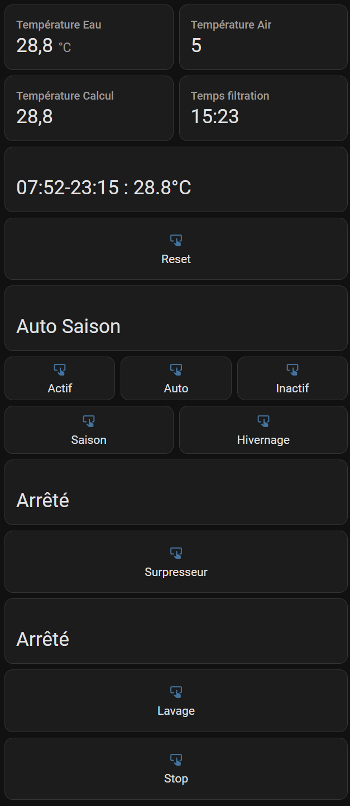
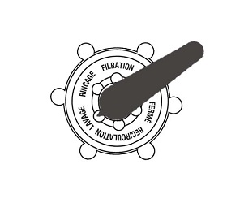
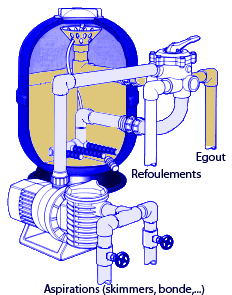
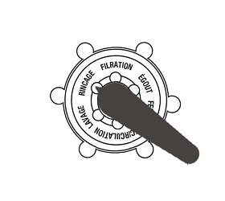
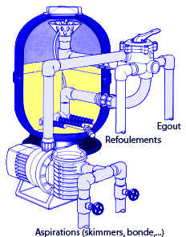
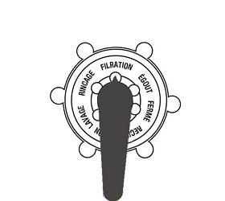
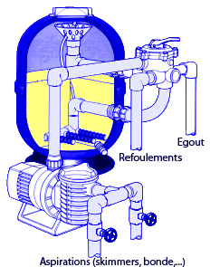

# Pool Control

[](https://github.com/scadinot/pool_control/actions/workflows/tests.yaml)
[](https://github.com/scadinot/pool_control/actions/workflows/Validate%20HACS.yaml)
[](https://github.com/scadinot/pool_control/actions/workflows/Validate%20Hassfest.yaml)

Composant Home Assistant permettant de gérer la filtration d'une piscine en fonction de la température.

## Table des matières

- [Fonctionnalités](#fonctionnalités)
- [Prérequis](#prérequis)
- [Installation](#installation)
  - [Via HACS (recommandé)](#via-hacs-recommandé)
  - [Installation manuelle](#installation-manuelle)
- [Configuration](#configuration)
  - [Capteurs et actionneurs requis](#capteurs-et-actionneurs-requis)
  - [Menu Filtration](#menu-filtration)
  - [Menu Hivernage](#menu-hivernage)
  - [Menu Avancé](#menu-avancé)
- [Comportement](#comportement)
  - [Mode Saison](#mode-saison)
  - [Mode Hivernage](#mode-hivernage)
  - [Sonde dans local technique](#sonde-dans-local-technique)
- [Entités exposées](#entités-exposées)
- [Tableau de bord](#tableau-de-bord)
- [Surpresseur](#surpresseur)
- [Lavage du filtre à sable](#lavage-du-filtre-à-sable)
- [Migration depuis l'ancienne version](#migration-depuis-lancienne-version)
- [Roadmap](#roadmap)
- [Changelog](#changelog)
- [Contribuer](#contribuer)
- [Licence](#licence)

## Fonctionnalités

- Calcul automatique du temps de filtration en fonction de la température de l'eau.
- Mode saison et mode hivernage avec bascule manuelle ou automatique.
- Mode hors-gel : marche forcée de la filtration sous un seuil de température.
- Pilotage du surpresseur (robot nettoyeur) avec temporisation de sécurité.
- Assistant guidé pour le lavage du filtre à sable (lavage / rinçage / filtration).
- Support des sondes déportées en local technique avec délai de stabilisation.
- Configuration entièrement via l'interface (Config Flow + Options Flow).
- Création automatique des capteurs et boutons : aucune entrée à ajouter dans `configuration.yaml`.

## Prérequis

- Home Assistant ≥ **2026.3**.
- Capteur de température de l'eau (`sensor` ou `input_number`).
- Capteur de température de l'air, ou donnée météo équivalente.
- Capteur de lever du soleil (typiquement `sensor.sun_next_rising`).
- Relais ou `input_boolean` pour : pompe de filtration, traitement (jusqu'à deux relais), surpresseur.

## Installation

### Via HACS (recommandé)

1. Installez [HACS](https://hacs.xyz/) si ce n'est pas déjà fait.
2. Ajoutez ce dépôt comme dépôt personnalisé dans les paramètres HACS.
3. Recherchez « Pool Control » dans HACS et cliquez sur **TÉLÉCHARGER**.
4. Redémarrez Home Assistant.
5. Allez dans **Paramètres** → **Appareils et services** → **Ajouter une intégration** et recherchez « Pool Control ».

### Installation manuelle

1. Ouvrez le répertoire de configuration de Home Assistant (celui qui contient `configuration.yaml`).
2. Créez le dossier `custom_components/` s'il n'existe pas.
3. Créez à l'intérieur un dossier `pool_control/`.
4. Copiez-y l'ensemble des fichiers de `custom_components/pool_control/` de ce dépôt.
5. Redémarrez Home Assistant.
6. Allez dans **Paramètres** → **Appareils et services** → **Ajouter une intégration** et recherchez « Pool Control ».

## Configuration

### Capteurs et actionneurs requis

À l'ajout de l'intégration, le Config Flow demande :

| Champ | Description |
|-------|-------------|
| Température de l'eau | Capteur de température du bassin |
| Température extérieure | Capteur ou donnée météo |
| Lever du soleil | Généralement `sensor.sun_next_rising` |
| Filtration | Relais de la pompe de filtration |
| Traitement | Relais du traitement chimique |
| Traitement 2 (optionnel) | Second relais de traitement si applicable |
| Surpresseur | Relais du surpresseur |

Une fois l'intégration ajoutée, ouvrez **Paramètres** → **Appareils et services** → **Pool Control** → **CONFIGURER** pour accéder aux menus suivants.

### Menu Filtration

| Paramètre | Valeurs / Plage | Description |
|-----------|-----------------|-------------|
| Méthode de calcul | Courbe (1) / Température / 2 (2) | Algorithme de calcul du temps de filtration |
| Coefficient d'ajustement | 0.3 à 1.7 | Multiplicateur appliqué au temps calculé |
| Horaire pivot | `HH:MM` (défaut `13:00`) | Heure centrale autour de laquelle la filtration est répartie |
| Pause pivot | minutes | Coupure au milieu du cycle |
| Répartition autour du pivot | 1/2 ↔ 1/2, 1/3 ↔ 2/3, 2/3 ↔ 1/3, 1/1 ↔, ↔ 1/1 | Distribution du temps avant/après le pivot |
| Temps de filtration minimum | heures | Plancher quotidien |

### Menu Hivernage

| Paramètre | Valeurs / Plage | Description |
|-----------|-----------------|-------------|
| Traitement pendant l'hivernage | on/off | Active le traitement chimique en hivernage |
| Coefficient d'ajustement hivernage | 0.3 à 1.7 | Multiplicateur dédié à l'hivernage |
| Répartition horaire hivernage | identique au menu Filtration | |
| Choix heure filtration | Lever du soleil (1) / Heure fixe (2) | Recommandé : lever du soleil pour le hors-gel |
| Horaire pivot hivernage | `HH:MM` (défaut `06:00`) | Si choix « Heure fixe » sélectionné |
| Température de sécurité | °C (défaut `-2`) | Seuil de déclenchement de la marche forcée hors-gel |
| Hystérésis température | °C (défaut `0.5`) | Évite les démarrages/arrêts intempestifs |
| Filtration 5mn / 3h | on/off | Lance la filtration 5 min toutes les 3 h |

### Menu Avancé

| Paramètre | Description |
|-----------|-------------|
| Désactiver marche forcée | Bascule auto en début de cycle |
| Sonde dans local technique | Active le mode sonde déportée |
| Pause avant relevé température | Délai de stabilisation (minutes) |
| Durée surpresseur | Minutes (défaut `5`) |
| Durée lavage | Minutes (défaut `2`) |
| Durée rinçage | Minutes (défaut `2`) |

## Comportement

### Mode Saison

Le temps de filtration est calculé d'après la température de l'eau :

- **Méthode courbe** : courbe optimisée pour les températures usuelles d'un bassin résidentiel.
- **Méthode température / 2** : règle classique (ex. 24 °C → 12 h de filtration).

Le résultat est ensuite réparti autour de l'horaire pivot selon la distribution choisie.

### Mode Hivernage

La filtration démarre 2 h avant le lever du soleil (ou à l'heure configurée) pour une durée minimale de 3 h.

- Si la température eau > 9 °C : temps calculé = température / 3.
- Si la température air < seuil de sécurité : marche forcée en continu (hors-gel).
- L'option « Filtration 5 mn / 3 h » assure une circulation régulière en cas de basses températures sans déclenchement hors-gel.

### Sonde dans local technique

Si la sonde est installée dans le local technique plutôt que dans le bassin :

- La température n'est échantillonnée que pendant la filtration.
- Une pause configurable laisse l'eau circuler avant que la sonde reflète la température réelle du bassin.

## Entités exposées

L'intégration crée automatiquement les entités suivantes — aucune `input_*` n'est à déclarer dans `configuration.yaml`.

### Capteurs

| Entité | Description |
|--------|-------------|
| `sensor.pool_control_asservissement_status` | État du mode de contrôle (Actif/Auto/Inactif + Saison/Hivernage) |
| `sensor.pool_control_filtration_time` | Temps de filtration calculé |
| `sensor.pool_control_filtration_schedule` | Plages horaires de filtration et température de référence |
| `sensor.pool_control_filtration_status` | État courant de la filtration |
| `sensor.pool_control_surpresseur_status` | État et compte à rebours du surpresseur |
| `sensor.pool_control_filtre_sable_lavage_status` | Étape courante de l'assistant de lavage |

### Boutons

| Entité | Action |
|--------|--------|
| `button.pool_control_reset` | Recalcule le temps de filtration |
| `button.pool_control_actif` | Mode manuel (marche forcée) |
| `button.pool_control_auto` | Mode automatique |
| `button.pool_control_inactif` | Désactive le contrôle automatique |
| `button.pool_control_saison` | Force le mode saison |
| `button.pool_control_hivernage` | Force le mode hivernage |
| `button.pool_control_surpresseur` | Lance le surpresseur pour la durée configurée |
| `button.pool_control_lavage` | Démarre / avance l'assistant de lavage |
| `button.pool_control_stop` | Arrête le surpresseur ou l'opération de lavage en cours |

## Tableau de bord



Exemple Lovelace exploitant les entités créées automatiquement :

```yaml
type: vertical-stack
cards:
  - type: horizontal-stack
    cards:
      - type: entity
        entity: sensor.votre_temperature_eau
        name: Température Eau
      - type: entity
        entity: sensor.votre_temperature_air
        name: Température Air
  - type: entity
    entity: sensor.pool_control_filtration_time
    name: Temps filtration
  - type: entity
    entity: sensor.pool_control_filtration_schedule
    name: Planning
  - type: button
    show_name: true
    show_icon: true
    tap_action:
      action: call-service
      service: button.press
      target:
        entity_id: button.pool_control_reset
    name: Reset
    icon: mdi:restart
  - type: entity
    entity: sensor.pool_control_asservissement_status
    name: État
  - type: horizontal-stack
    cards:
      - type: button
        tap_action:
          action: call-service
          service: button.press
          target:
            entity_id: button.pool_control_actif
        name: Actif
        icon: mdi:play-circle
      - type: button
        tap_action:
          action: call-service
          service: button.press
          target:
            entity_id: button.pool_control_auto
        name: Auto
        icon: mdi:auto-fix
      - type: button
        tap_action:
          action: call-service
          service: button.press
          target:
            entity_id: button.pool_control_inactif
        name: Inactif
        icon: mdi:stop-circle
  - type: horizontal-stack
    cards:
      - type: button
        tap_action:
          action: call-service
          service: button.press
          target:
            entity_id: button.pool_control_saison
        name: Saison
        icon: mdi:weather-sunny
      - type: button
        tap_action:
          action: call-service
          service: button.press
          target:
            entity_id: button.pool_control_hivernage
        name: Hivernage
        icon: mdi:snowflake
  - type: entity
    entity: sensor.pool_control_surpresseur_status
    name: Surpresseur
  - type: button
    tap_action:
      action: call-service
      service: button.press
      target:
        entity_id: button.pool_control_surpresseur
    name: Surpresseur
    icon: mdi:pump
  - type: entity
    entity: sensor.pool_control_filtre_sable_lavage_status
    name: Lavage
  - type: button
    tap_action:
      action: call-service
      service: button.press
      target:
        entity_id: button.pool_control_lavage
    name: Lavage
    icon: mdi:air-filter
  - type: button
    tap_action:
      action: call-service
      service: button.press
      target:
        entity_id: button.pool_control_stop
    name: Stop
    icon: mdi:stop
```

## Surpresseur

L'appui sur le bouton **Surpresseur** lance le surpresseur pour la durée configurée. Si la filtration n'est pas active, elle est démarrée d'abord, puis le surpresseur après une temporisation de quelques secondes — cette pause évite d'endommager le surpresseur en attendant que l'eau circule dans le circuit.

Le capteur `sensor.pool_control_surpresseur_status` affiche le temps restant sous forme de compte à rebours. À la fin du cycle, le surpresseur s'arrête, ainsi que la filtration si elle n'était pas active auparavant. Le bouton **Stop** permet d'interrompre le cycle à tout moment.

## Lavage du filtre à sable

L'assistant guide les opérations de lavage / rinçage / remise en filtration.

1. Appuyez sur **Lavage**. La filtration s'arrête, le capteur affiche `[Arrêt, position lavage]`.
2. Positionnez la vanne sur **Lavage**, puis appuyez à nouveau sur **Lavage**.

   

   La filtration redémarre, le capteur affiche `[Lavage : xx]` (compte à rebours).

   

3. À la fin du lavage, le capteur affiche `[Arrêt, position rinçage]`. Positionnez la vanne sur **Rinçage**, puis appuyez sur **Lavage**.

   

   Le capteur affiche `[Rinçage : xx]`.

   

4. À la fin du rinçage, le capteur affiche `[Filtration]`. Repositionnez la vanne sur **Filtration**, puis appuyez sur **Lavage**.

   

   Si la filtration était active avant l'opération, elle reprend automatiquement.

   

Le bouton **Stop** interrompt l'assistant à tout moment.

## Migration depuis l'ancienne version

Pour les utilisateurs venant d'une version configurée par `configuration.yaml` :

1. **Sauvegardez** votre configuration actuelle.
2. **Supprimez** la section `pool_control:` de `configuration.yaml`.
3. **Redémarrez** Home Assistant.
4. **Ajoutez** l'intégration via **Paramètres** → **Appareils et services** → **Ajouter une intégration**.
5. **Supprimez** les `input_button`, `input_text` et `input_number` créés manuellement : ils sont remplacés par les entités auto-créées.
6. **Mettez à jour** votre tableau de bord avec les nouveaux ID d'entités (voir ci-dessus).

Astuce : notez vos paramètres avant la migration pour les ressaisir rapidement dans le Config Flow.

## Roadmap

Les évolutions prévues sont décrites dans [ROADMAP.md](ROADMAP.md).

## Changelog

L'historique détaillé des versions est disponible dans [CHANGELOG.md](CHANGELOG.md).

## Contribuer

Les issues et pull requests sont les bienvenues sur [GitHub](https://github.com/scadinot/pool_control). Avant de proposer un changement de comportement significatif, ouvrez d'abord une issue pour en discuter.

### Structure du dépôt

```
pool_control/
├── .github/
│   └── workflows/             # CI GitHub Actions
├── custom_components/
│   └── pool_control/
│       ├── __init__.py
│       ├── activation.py
│       ├── brand/             # assets de marque (HA ≥ 2026.3)
│       │   ├── icon.png       # 256×256
│       │   └── icon@2x.png    # 512×512
│       ├── button.py
│       ├── buttons.py
│       ├── config_flow.py
│       ├── const.py
│       ├── controller.py
│       ├── entities.py
│       ├── filtration.py
│       ├── hivernage.py
│       ├── lavage.py
│       ├── manifest.json
│       ├── options_flow.py
│       ├── saison.py
│       ├── scheduler.py
│       ├── sensor.py
│       ├── sensors.py
│       ├── service.py
│       ├── strings.json
│       ├── surpresseur.py
│       ├── traitement.py
│       ├── translations/
│       └── utils.py
├── img/                       # captures et schémas pour la documentation
├── tests/                     # suite pytest
├── CHANGELOG.md
├── LICENSE
├── README.md
├── ROADMAP.md
├── hacs.json
├── pytest.ini
└── requirements_test.txt
```

### Tests locaux

```bash
pip install -r requirements_test.txt
pytest tests/ -v
```

La suite couvre 350 tests sur 12 modules et doit rester à 100 % avant tout merge.

## Licence

Distribué sous licence MIT. Voir [LICENSE](LICENSE).
